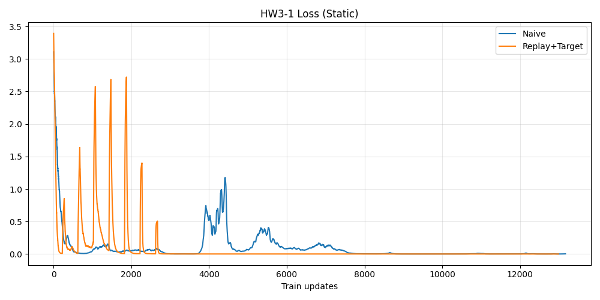
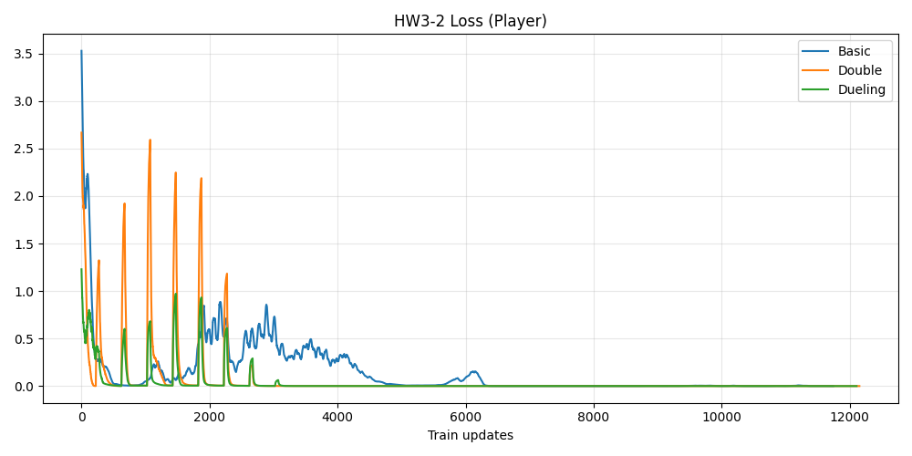
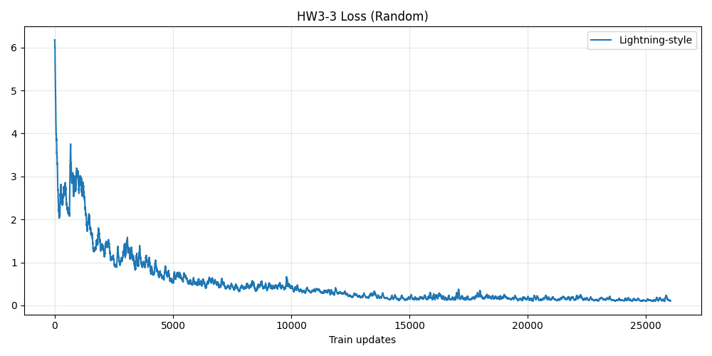
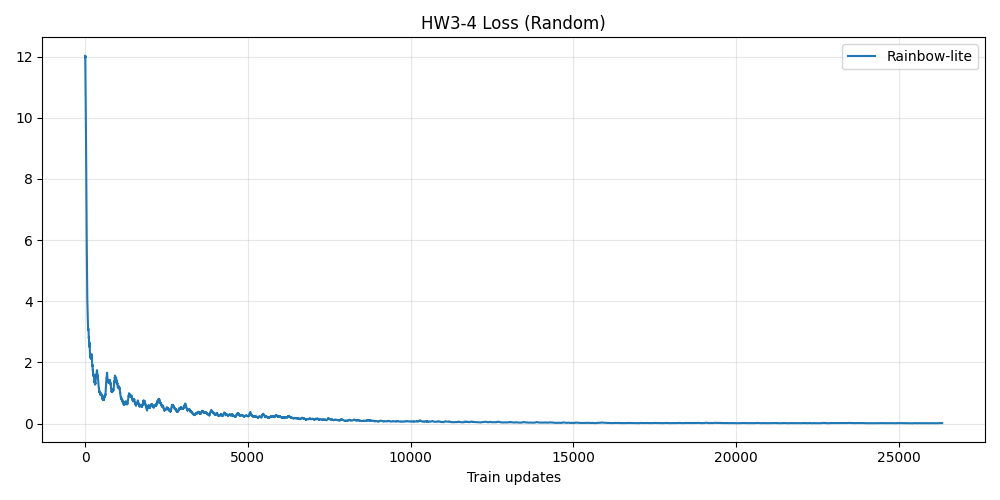
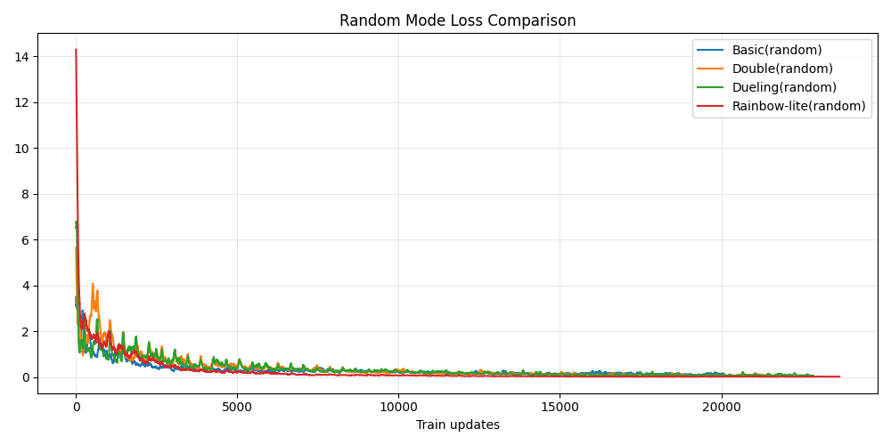
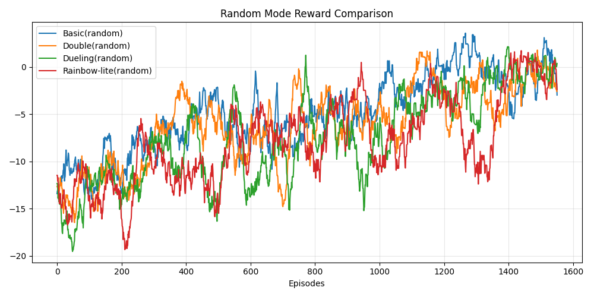
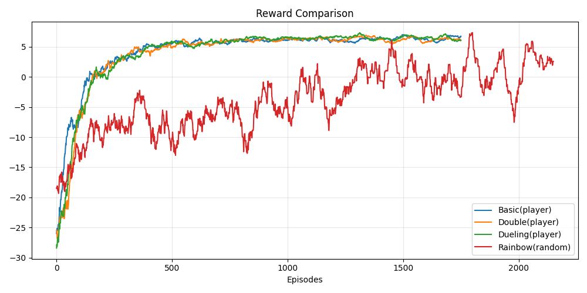

# DRL HW3 - DQN and Its Variants

本專案完成 Homework 3 四個部分，並提供可重現的訓練腳本、圖表與指標輸出。

## 1) 作業需求與對應實作

### HW3-1 Naive DQN for static mode
需求：
- 以基本 DQN 解 static GridWorld
- 包含 Experience Replay 概念

實作：
- `HW3_DQN.py` 中 `train_dqn_variant(..., variant='basic')` 作為 Naive
- 使用 `ReplayBuffer` + mini-batch 更新
- 對照組以含 target bootstrapping 的 replay/target 設定比較

輸出：
- `demo/hw3_1_losses.png`
- `demo/metrics.json` 的 `hw3_1_naive`, `hw3_1_replay`



### HW3-2 Enhanced DQN Variants for player mode
需求：
- 比較 Double DQN 與 Dueling DQN
- 重點說明相較 basic DQN 的改進

實作：
- Basic: `variant='basic'`
- Double: `variant='double'`（online 選動作 + target 評估）
- Dueling: `variant='dueling'`（Value/Advantage 分流）
- 同一套訓練設定下比較

輸出：
- `demo/hw3_2_losses.png`
- `demo/metrics.json` 的 `hw3_2_basic`, `hw3_2_double`, `hw3_2_dueling`



### HW3-3 Random mode + Training Tips (Lightning-style)
需求：
- 在 random mode 強化訓練
- 使用 PyTorch Lightning 或 Keras（本作業採 Lightning 方向）

實作：
- 主要訓練在 random mode
- 導入訓練穩定技巧：gradient clipping、learning-rate scheduler
- 程式中保留 `DQNLightning` 模組骨架（Lightning-style）

輸出：
- `demo/hw3_3_losses.png`
- `demo/metrics.json` 的 `hw3_3_lightning_style`



### HW3-4 Bonus: Rainbow DQN for random mode
需求：
- 分析並實作 Rainbow 方向

實作：
- 本專案採 Rainbow-lite：Double + Dueling + Prioritized Replay + Target
- 並新增公平比較：所有模型都在 random mode 對比

輸出：
- `demo/hw3_4_losses.png`
- `demo/random_compare_losses.png`
- `demo/random_compare_rewards.png`
- `demo/metrics.json` 的 `random_compare_*`



## 2) 主要結果

### 各作業主結果
- HW3-1 Naive (static): Win Rate 100.0%, Avg Steps 7.00
- HW3-1 Replay/Target (static): Win Rate 100.0%, Avg Steps 7.00
- HW3-2 Basic (player): Win Rate 100.0%, Avg Steps 4.465
- HW3-2 Double (player): Win Rate 100.0%, Avg Steps 4.27
- HW3-2 Dueling (player): Win Rate 100.0%, Avg Steps 4.42
- HW3-3 Lightning-style (random): Win Rate 86.5%, Avg Steps 9.52
- HW3-4 Rainbow-lite (random): Win Rate 85.5%, Avg Steps 9.91

### Random mode 公平比較（同環境、同流程）
- Basic: Win Rate 83.0%, Avg Steps 10.305
- Double: Win Rate 81.5%, Avg Steps 12.115
- Dueling: Win Rate 82.5%, Avg Steps 11.75
- Rainbow-lite: Win Rate 88.5%, Avg Steps 9.01

解讀：
- 在 random mode 的公平比較中，Rainbow-lite 同時有最高勝率與較少步數，顯示多技巧整合在高變化環境更有優勢。
- 若以 player vs random 交叉比較則不公平，因此報告以 random-only 對照為主。





## 3) 如何執行

```bash
python HW3_DQN.py
```

可調回合：
```bash
python HW3_DQN.py --ep-hw1 1200 --ep-hw2 1800 --ep-hw3 2000 --ep-hw4 2200 --ep-cmp 1600
```

## 4) 專案重點檔案
- `HW3_DQN.py`: 主訓練與評估腳本
- `gridworld.py`, `gridboard.py`: GridWorld 環境
- `report.md`: 作業報告
- `demo/*.png`, `demo/metrics.json`: 成果圖與指標
- `conversation.log`: 本次對話與操作紀錄
